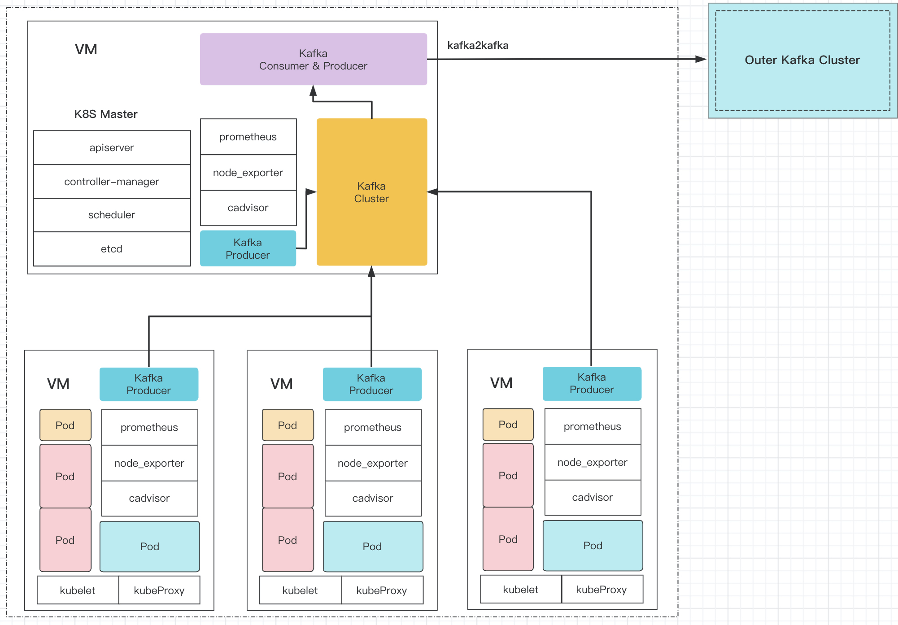

# phystats
## Introduction


## Install
### Runtime Environment

1. Requirements

`pip install < requirements.txt` , content of requirements as follows:
```Shell
sudo apt-get install -y python3 python3-pip
pip install --upgrade pip
```
```
kafka==1.3.5
kafka-python==2.0.2
websocket-client==0.59.0
docker==4.1.0
docker-compose==1.25.0
redis==3.5.3
kubernetes==17.17.0
requests==2.22.0
urllib3==1.25.8
```

2. Docker-Compose

Required docker images:
- [prom/prometheus](https://hub.docker.com/r/prom/prometheus)
- [prom/node-exporter](https://hub.docker.com/r/prom/node-exporter)
- [google/cadvisor](https://hub.docker.com/r/google/cadvisor)
- [redis](https://hub.docker.com/_/redis)
- [grafana/grafana](https://hub.docker.com/r/grafana/grafana), `optional`
```Shell
 docker pull prom/prometheus
 docker pull prom/node-exporter
 docker pull google/cadvisor
 docker pull redis
 docker pull grafana/grafana
```
`prometheus.yml`:
```Yaml
global:
  # 设置抓取数据的时间间隔，间隔设置为每15秒一次。默认为每1分钟。
  scrape_interval: 15s
  # 设定抓取数据的超时时间，默认为10s
  scrape_timeout: 10s
  # 设置规则刷新，每15秒刷新一次规则。默认值为每1分钟。
  evaluation_interval: 15s

# 普罗米修斯与抓取模块交互的接口配置
scrape_configs:
  - job_name: prometheus
    static_configs:
      - targets:
        - localhost:9090

  - job_name: cadvisor
    static_configs:
      - targets:
        - localhost:8081

  - job_name: node_exporter
    static_configs:
      - targets:
        - localhost:9100
```


`docker-compose.yml`:
```Yaml
version: '3.2'
services:
  prometheus:
    image: prom/prometheus:latest
    container_name: prometheus
    command:
      - --config.file=/etc/prometheus/prometheus.yml
    ports:
      - "9090:9090"
    volumes:
      - ./prometheus.yml:/etc/prometheus/prometheus.yml:ro
    depends_on:
      - node_exporter
      - cadvisor

  cadvisor:
    image: google/cadvisor:latest
    container_name: cadvisor
    ports:
      - "8081:8080"
    volumes:
    - /:/rootfs:ro
    - /var/run:/var/run:rw
    - /sys:/sys:ro
    - /var/lib/docker/:/var/lib/docker:ro
    depends_on:
    - redis

  redis:
    image: redis:latest
    container_name: redis
    ports:
      - "6379:6379"
    volumes:
      - redis_data:/data

  node_exporter:
    image: prom/node-exporter:latest
    container_name: node_exporter
    command:
      - '--path.procfs=/host/proc'
      - '--path.sysfs=/host/sys'
      - '--collector.filesystem.ignored-mount-points=^/(sys|proc|dev|host|etc)($$|/)'
      - '--collector.textfile.directory=/node_exporter/prom'
    restart: unless-stopped
    ports:
      - "9100:9100"
    volumes:
      - /proc:/host/proc
      - /sys:/host/sys
      - /:/rootfs
  grafana:
    image: grafana/grafana:latest
    container_name: grafana
    ports:
      - "3000:3000"
    volumes:
      - grafana_etc:/etc/grafana
      - grafana_lib:/var/lib/grafana
      - grafana_log:/var/log/grafana
    depends_on:
    - prometheus

volumes:
  grafana_etc:
  grafana_lib:
  grafana_log:
  redis_data:
  redis_conf:
```

## Run
### Start service
1. prometheus related
```Bash
docker-compose -f phystats/dockers/docker-compose.yml up -d
```

2. start zookeeper and kafka
```Bash
bin/zookeeper-server-start.sh -daemon config/zookeeper.properties
bin/kafka-server-start.sh  -daemon config/server.properties
bin/kafka-topics.sh --create --topic phystats --partitions 1 --replication-factor 1 --bootstrap-server localhost:9092
```

### Collect data
1. Collect metrics
``` Bash
python3 main.py --role="collector" --host="localhost" --port="9090" --kafka_host="localhost" --kafka_port="9092" --kafka_topic="phystats" --collect_interval=5.0
```

1. k8s_info
``` Bash
python3 main.py --role="k8s_info" --host="localhost" --port="9090" --kafka_host="localhost" --kafka_port="9092" --kafka_topic="phystats" --k8s_interval=5.0
```

3. consumer
``` Bash
python3 main.py --role="consumer" --kafka_host="localhost" --kafka_port="9092" --kafka_topic="phystats" --limit=10000
```

4. kafka2kafka
``` Bash
python3 kafka2kafka --from_host="localhost" --from_port="9092" --from_topic="phystats" --to_host="localhost" --to_port="9092" --to_topic="phystats"
```